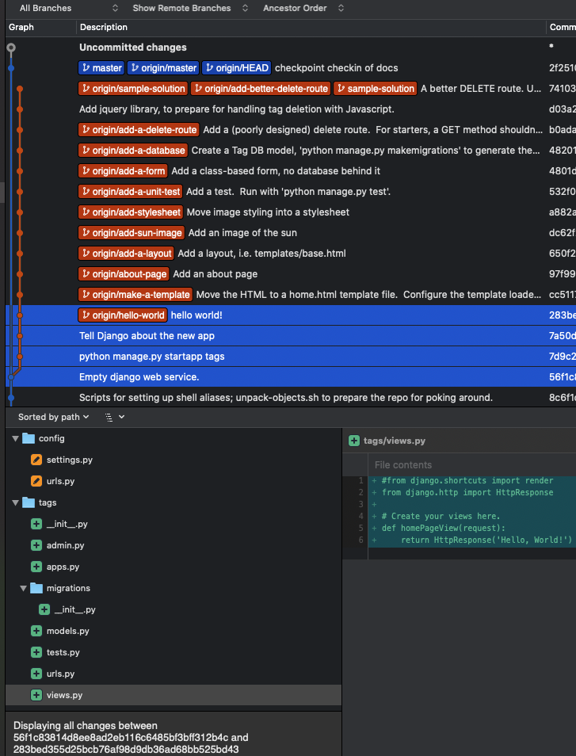

# Prework for Collaboration-With-Git Exercise

## Environment assumptions
This exercise assumes you have ...
1. A [GitHub](https://github.com){:target="_blank"} account.
1. Python3 3.5 or newer, so that the builtin 'venv' module can be used for configuring virtual environments.
1. Installed [SourceTree](https://sourcetreeapp.com){:target="_blank"}, an GUI for visualizing Git repos.

## Fork & clone the repo

1. Fork [https://github.com/walquis/tags](https://github.com/walquis/tags){:target="_blank"} (but note that when the actual project starts, you'll need to clone a fresh copy from your *team lead's* fork, not your own fork---so that you'll be able to push changes to a shared repo).

2. Clone your fork
Run these commands in a Terminal session (for best results, I recommend starting Terminal.app separately, rather than running a terminal session within your IDE).  You should be able to copy/paste these shell commands pretty much verbatim, except that you need to replace \<yourlogin\> with your own login.

NOTE: Again, I highly recommend opening shell windows using the Terminal app on your Mac, and not using whatever shell your IDE opens.  IDE environment-handling adds a layer of complexity that tends to thwart our purposes here. (If you know exactly how your IDE populates the shell environment, then go right ahead and use its embedded shell).

```bash
cd                          # Start from your home directory
mkdir -p src
cd src                      # Or cd to wherever you keep code projects
git clone https://github.com/<yourlogin>/tags    # Clone your fork
# (Note that when the actual project exercise starts, you'll need to re-clone from your team lead's fork).
cd tags
```

## Decide whether you're going down the MILD or SPICY path

Here's where you get to choose your own adventure!

NOTE: Since you'll be working with a team, your _whole team_ will be going down the same path.  Be sure to assemble your team and reach a consensus before choosing.

### Choose MILD...
...If your team prefers to just focus on learning git, and not worry about getting Python environments, Django webservers, databases etc. up and running all at the same time.  Scroll down the page to the MILD PATH, and work with a static HTML page.

### Choose SPICY...
...If you all decide you're comfortable with the command line, and somewhat familiar with Python virtual environments, Django, databases, and/or you're up for making it all work while learning git.  Don't worry, the path is still well laid out, even though there is more going on.  Go SPICY, and get it all running!

## SPICY PATH: Set up and run the webapp

1. Run these commands in a Terminal session (for best results, I recommend starting Terminal.app separately, rather than running a terminal session within your IDE).  You should be able to copy/paste these shell commands pretty much verbatim, except that you need to replace \<yourlogin\> with your own login.
```bash
# Assuming you have cd'd to the tags repo...
python3 -m venv venv             # Use the "venv" module to create a virtual env in the "venv" directory
source venv/bin/activate         # Enter your python3 virtual env
pip install -r requirements.txt  # Populate current virtual env with packages
python manage.py migrate         # Keep Django from complaining about unapplied migrations
python manage.py runserver 8000  # Change 8000 if you need another port (but it must be larger than 1023)
```
1. Visit [http://localhost:8000](http://localhost:8000){:target="_blank"} in your browser.

To stop the app: At your shell prompt, hold down the Ctrl key and press 'c'.

(To exit your virtual environment, type 'deactivate'. This is the complement of "source venv/bin/activate" that we ran above.)

### Explore the code - SPICY
So what is running, exactly?  You're on the `master` branch of this repo, and the webserver you started up is hosting an empty application.

Let's work our way through the set of sample changes by checking out the corresponding branches, starting from `master` and progressing to the tip of the `sample-solution` branch.  See [Viewing Changes](viewing-changes){:target="_blank"} for hints and tips.

#### hello-world
Check out the `hello-world` branch, and start the app.  (I find it handy to have multiple Terminal windows--one for running the git commands, and one for running the default Django webserver, which automagically reloads when it sees changes).  If you've done the setup described above, your Terminal session would look something like this:
```
$ git checkout hello-world
Branch 'hello-world' set up to track remote branch 'hello-world' from 'origin'.
Switched to a new branch 'hello-world'
$ python manage.py runserver   # Defaults to 8000; add a port-number arg if needed, as shown above
```
Visit [http://localhost:8000](http://localhost:8000).  You should see "Hello, World!" displayed.  Selecting changes in SourceTree as shown below, you can see and browse what had to happen to make this work.



#### make-a-template
Now checkout the `make-a-template` branch.  (If you have `python manage.py runserver` running in a separate Terminal window, it will see the changes and reload the server automatically).

It's a little "hard-coded" to put the actual HTML in the same file as the view logic, so this change moves the "Hello, World!" into a template file.  In config/settings.py, we tell Django where to look for templates.

No functionality has changed at http://localhost:8000, but now we're better positioned to make changes, such as...

#### about-page
Checkout the `about-page` branch. The /about route is added in urls.py, and its content as a template file.

#### Continuing ...
Keep checking out successive branches, viewing code changes in SourceTree while you observe the behavior in the browser.

#### add-a-database
With this particular change, there is a little extra work to do, since a database has entered the picture (actually, it was there already, but we just weren't using it).  Because we need a "tags" table, we have to tell Django to add it, corresponding to the `Tag` model we've added.  (Forgetting this step results in "Operational Error at /" in the browser).
```
$ python manage.py migrate
```
At this point, you can begin typing tags into the input box, and seeing them show up in the list below.

#### ...all the way to `sample-solution`!
After checking out a couple more changes having to do with adding the ability to delete tags, you've arrived at the tip of the `sample-solution` branch!

#### A side note - Debugging with [IPython](https://ipython.readthedocs.io/en/stable/){:target="_blank"}

On the `sample-solution` branch, open tags/views.py, and notice the commented-out ```# embed()``` (as well as the ```from IPython import embed```).  Try uncommenting the ```embed()``` and refreshing the browser (assuming your webserver picks up the change automatically; if not, restart the webserver first).

Code execution now stops at the embed() breakpoint.  You can examine variables by typing them (for instance `request.method`), or run arbitrary code that makes sense in this context.

When ready to continue, type ```quit```.  (And also, don't forget to comment out embed() again).

#### Another side note - looking at the Sqlite data directly

To browse your DB without Django, install Sqlite3.  On a Mac, this would be
```
brew install sqlite
```
Where does your Sqlite database live?  [HINT: a settings file might know]

Fire up sqlite3 and start running queries.  In sqlite, commands other than SQL queries are prefixed with ".", e.g. ".help".  To exit, ".q", and so on.
```
$ sqlite3 <path-to-sqlite3-database-file>
sqlite> .headers on
sqlite> .mode column
sqlite> select * from tags_tag;
```

## MILD PATH: Work with a static HTML page

```bash
# Assuming you have cd'd to the tags repo already...
cd mild
open tags.html  # Should pop open an empty page in your browser.
```

### Explore the code - MILD
You're on the `master` branch of this repo, and the mild/tags.html page you opened is where you'll build up some static HTML.  The only "webserver" is your filesystem (which, although very simple does not get you very far, as we will see).

Let's work our way through the set of sample changes by checking out the corresponding branches, starting from `master` and progressing to the tip of the `10-mild-sample-solution` branch (the "mild" branches are prefixed with a number and "-mild-").  See [Viewing Changes](viewing-changes){:target="_blank"} for hints and tips.

#### 1-mild-hello-world
Check out the `hello-world` branch:
```
$ git checkout 1-mild-hello-world
Branch '1-mild-hello-world' set up to track remote branch 'hello-world' from 'origin'.
Switched to a new branch '1-mild-hello-world'
$
```

Refresh your page.  You should see "Hello, World!" displayed.  In SourceTree, select the relevant commits to see what had to happen to make this work. (For mild, not much!)

#### 2-mild-about-page

Now checkout the ```2-mild-about-page``` branch, and refresh your browser.  Examine the commit in SourceTree.  Why doesn't the browser change?  Because the about.html page has been added, but there is no link to it from tags.html.  (In light of that shortcoming, how would you view about.html?)

#### Continuing …

Keep checking out successive "<number>-mild-*" branches, refreshing your browser and viewing code changes in SourceTree.

## What's Next?

In class, you and your team will be making these same changes, but **in parallel**, getting a taste of what collaboration looks like with git.

## Bonus prework - explore some [Unix/Shell Concepts](unix-shell-concepts)
I'll cover these *very* briefly in class, but feel free to google around on your own, focusing on the bash shell.
