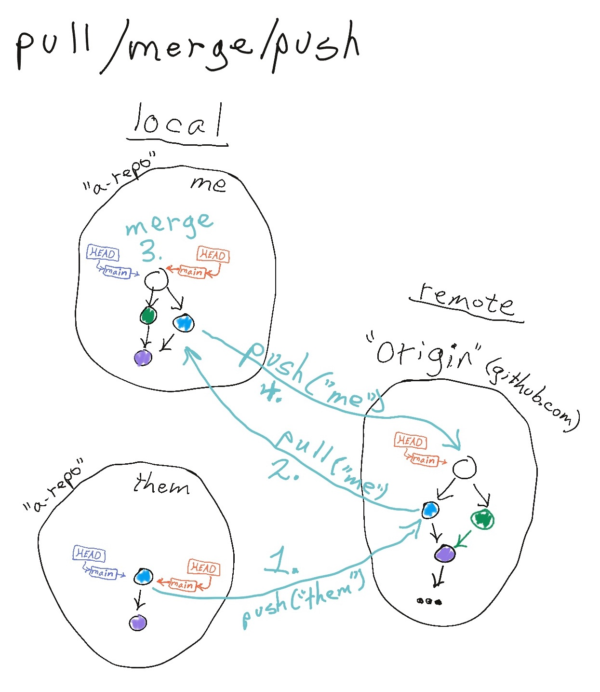
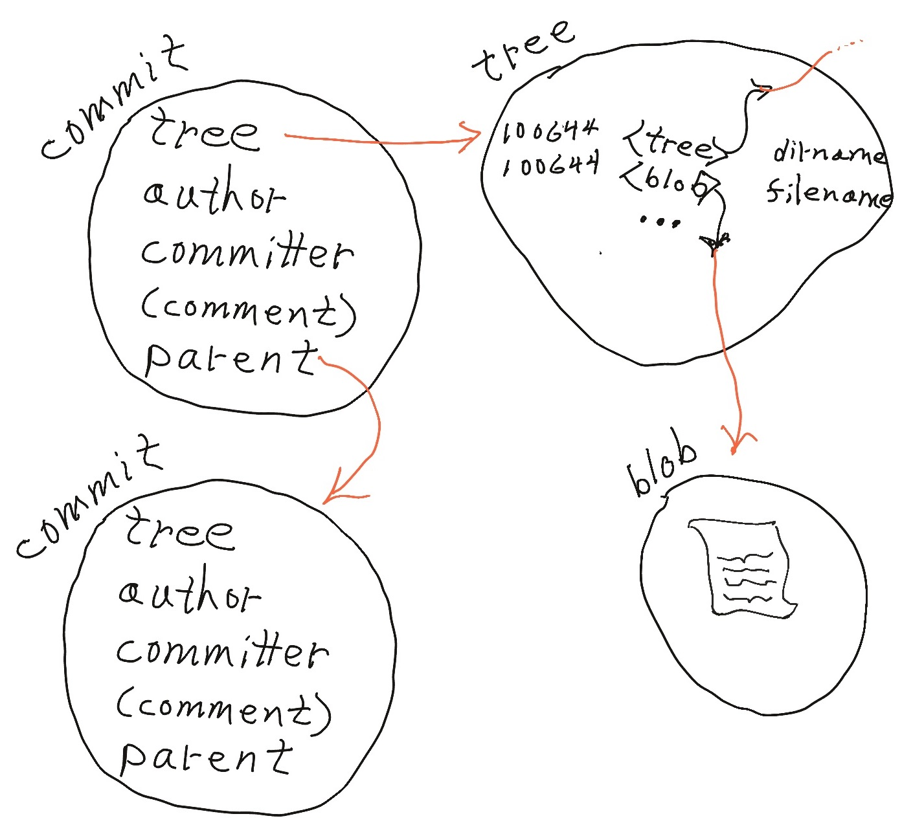
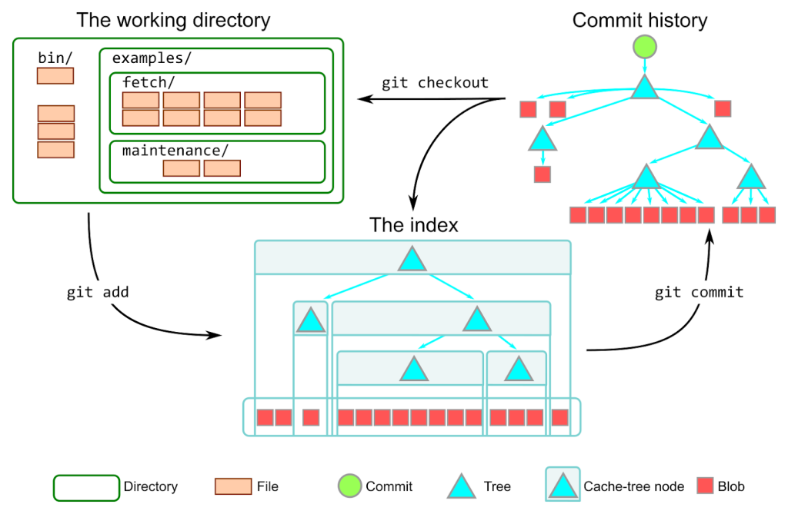

## Session One

### Setup
1. Has everyone done the [Prework](prework.md)?
1. Open your Linux shell.
1. Run these commands to set up some handy aliases...
```bash
# Clone this repo only if you haven't already done so...
git clone https://github.com/walquis/git-basics-team-project
cd git-basics-team-project/bin
source git-aliases.sh
```
1. Define your project teams.
1. Choose a team lead.
1. Team lead: create a repo (check the box for including a README)
1. Invite your team as collaborators
1. Team: Clone your team lead's repo (do NOT fork it!)
1. Take a look at a sample project repo.

**Checkpoint: Everyone has their team lead's repo cloned (including the team lead)**.

### Basic Collaborative Workflow

**Vocabulary**: remote, merge commit, fast-forward merge

**Commands**: `git pull`, `git add`, `git commit`, `git push`, `git fetch`, `git merge`

A basic workflow in the "shared-repo development model":


#### LAB - Basic Collaborative Workflow
> Each member of the team commit and push at least one (non-merge-conflicting) change.  For instance, each member
> can add one of these files: `index.html`, `help.html`, `about.html`, `faq.html`, `map.html`.

### The Anatomy of a Git Commit, or, The Three Objects

**Vocabulary**: sha, content-addressable, blob, tree, commit

**Commands**: 
- `git cat-file -p` - just for teaching purposes; not part of a normal git workflow
- `git reflog`

Now that we have some commits, let's take a closer look...



#### LAB - Anatomy of a Git Commit, or, The Three Objects
> Use `git cat-file -p` to answer these questions:
> 1. What fields does HEAD have?
> 1. What kind of SHA is HEAD's "parent" field? (Use `-t` instead of `-p`)
> 1. What fields does HEAD's tree have?
> 1. What are the contents of HEAD's tree's first blob?

### Your Local Git repo and The Three Trees - or, "Intro to `git reset`"
**Vocabulary**:
- workspace, index, HEAD
- "detached HEAD" state

**Commands**: `git diff`, `git diff --staged`, `git reflog`, `git stash`

When I last checked (end of March 2023), six of the [top twelve stackoverflow questions](https://stackoverflow.com/questions?tab=Votes) were git questions!!  For at least a couple of those, the answer is `git reset`.

Today we will learn to use `git reset` to move changes back and forth (locally) between the [The Three Trees](objects-and-trees-exercise.md).

This is a rather busy diagram, but worth staring at ...


#### LAB - Practicing with `git reset`
Use each of the `--soft`, `--mixed`, and `--hard` options to `git reset` at least once.
> 1. Make a change and commit it (do not `git push`!).
> 1. Revert the change using `git reset`.
> 1. Make another change, and commit.
> 1. Revert, using another option of `git reset`.  Commit.
> 1. Revert, using another option of `git reset`.  Commit.

We've only used `git reset` to move our current branch back one commit.  But with `git reset`, we can move our current branch anywhere we want.  When might this be useful?

**Scenario**: You accidentally make commits on `main`, but then realize you should be on a branch--for instance, in order to push that branch and submit a Pull Request for it (we'll discuss PR's soon).

#### LAB - Simulate branching "after-the-fact"
> 1. Make 3 or 4 commits on `main`.  Then realize Oops, I should be on another branch.
> 1. Make a branch at your current location.  _Hover [here](doesnotexist.jpg, "'git branch mybranch' (not 'git checkout mybranch'!  Why is that?)") for a hint._
> 1. Use `git reset` to move `main` back to where it should be.

### Create And Resolve Merge Conflicts - With Basic Workflow

#### LAB - merge conflicts
> 1. Each teammate: Change the same line in same file (e.g. Change "The Solar System" in `index.html` to some other text).
> 1. Commit. 
> 1. One teammate do a `git push`; the others `git pull`.
> 1. Among your team, resolve merge conflicts and `git push` until you all have the same commit sha for HEAD.

### Create And Resolve Merge Conflicts - Using Branches and PR's
Github supports [two collaborative development models](https://docs.github.com/en/pull-requests/collaborating-with-pull-requests/getting-started/about-collaborative-development-models):
- fork and pull
- shared repository <--- This is us

>>"In the shared repository model, collaborators are granted push access to a single shared repository and topic branches are created when changes need to be made. Pull requests (PR's) are useful in this model as they initiate code review and general discussion about a set of changes before the changes are merged into the main development branch. This model is more prevalent with small teams and organizations collaborating on private projects."

We'll be working with the shared repository model.

🤔 Why is it called a "**Pull** Request", if you're **pushing** changes?

#### LAB - Create/Handle merge conflicts again - but now using Pull Requests in your workflow
> 1. Each teammate: `git checkout -b` _yourOwnBranchName_
> 1. Each teammate: Change the same line in same file, like before.
> 1. Commit. 
> 1. `git push` _yourOwnBranchName_
> 1. Go to Github and make a PR for your branch; choose one or more reviewers.
> 1. Reviewers: review/approve the PRs and merge.
> 1. Review and merge, `git pull`, etc. until you all have the same commit sha for HEAD.


