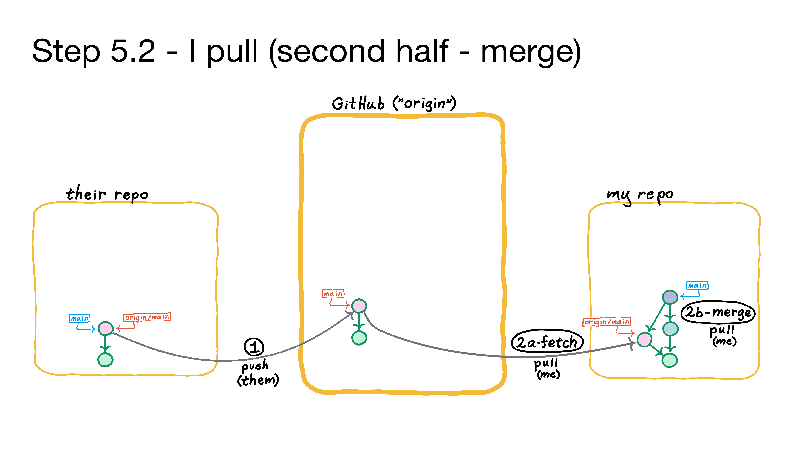

The second half of the `git pull` is a "merge", shown above. The merge commit is represented by the grayish circle.

### Key Points:
- By definition, **a merge commit is a commit with two or more parents**.
- **A merge attempt may result in a conflict**; we'll cover conflicts later in this course.
- **A merge commit is not created until the merge is complete**, whether automatically by git, or manually by resolving merge conflicts.
- **It's generally not obvious from a commit graph whether a merge had conflicts.**
