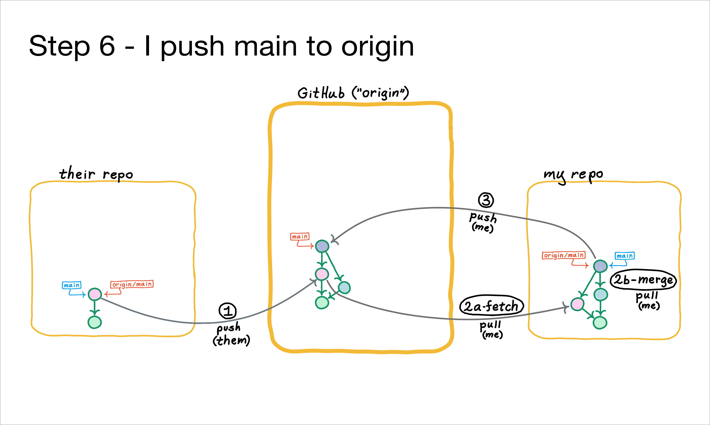

Now that I've done the work on my local `main` branch to integrate the changes (via a merge commit), I can push that work on `main` back to the remote called "origin", like this:
```
$ git push origin main 
```
Now I'm all caught up, and the remote is caught up.

### Key Points:
- **Two commits are sent to the remote**: My original local commit, and the merge commit.
- **My `git push` updated the remote's `main` branch to reflect my new work**. Correspondingly, my local <span class="hljs" style="color:red">origin/main</span>
tracking branch is updated as well.  In other words, the same process happened for me when I pushed, as happened for my teammate when they pushed.
- As before, my push updates the remote called "origin" (which happens to be Github), but **it does NOT update anything in my teammate's repo**; that would require explicit activity on their part.
- Now my teammate  is behind!  That is, their `origin/main` tracking branch no longer matches `main` on the remote called "origin".  How would they catch up?
