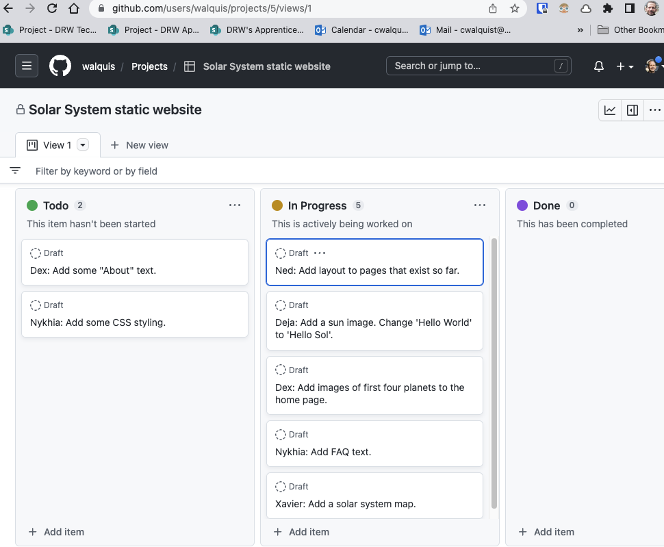

# Consider Using a Github Project Board

Github Projects is a low-overhead, low-barrier-to-entry tool for managing project tasks and milestones.

Github Projects have lots of integrations with repos, issues, PRs, etc.  But you can start simple, and add integrations as you need them--or not.

Here's what a board for the sample Solar System website might look like:

Some jumping-off points:
- [Best practices for Github Projects](https://docs.github.com/en/issues/planning-and-tracking-with-projects/learning-about-projects/best-practices-for-projects)
- [link a Pull Request to an issue](https://docs.github.com/en/issues/tracking-your-work-with-issues/linking-a-pull-request-to-an-issue)

